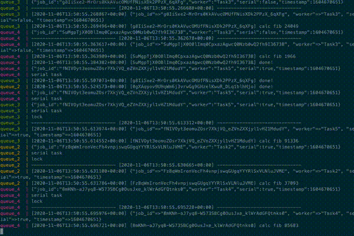

# Tasker

## DESCRIPTION

Async tasks processor. Tasks: Task1, Task2, Task3, Task4, Task5

## USAGE

Build docker image:

    docker build . -t tasker/tasker

Run docker-compose command:

    docker-compose up -d

Scale queue processors!

    docker-compose up -d --scale queue=4

Generate fake tasks:

    docker-compose run api "ruby generate_tasks.rb"

## API

Post new task:

    curl -XPOST http://localhost:3000/tasks -d 'task_name=Task1'

Get info for tasks:

    curl http://localhost:3000/tasks
